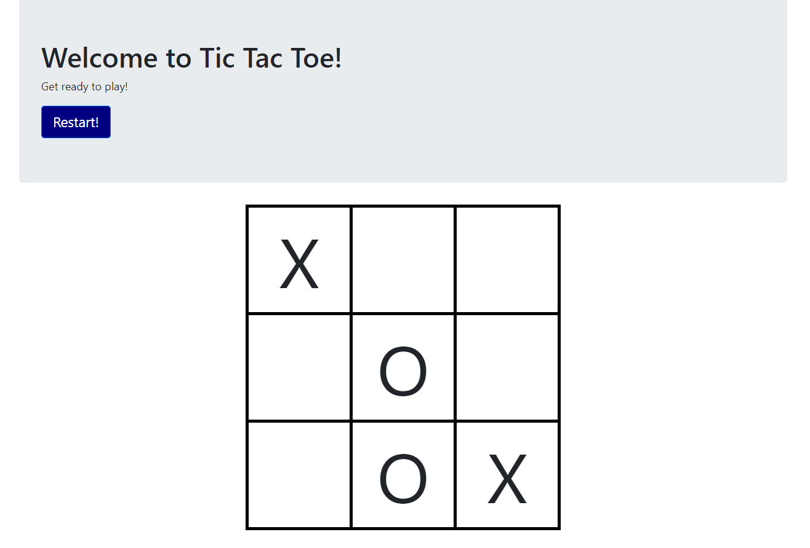

# Udemy-Web-Developer-Bootcamp-Javascript
Studies of Javascript

Contents:

(Javascript)
- Basics
- Connecting Javascript
- Operators
- Control Flow
- Loops
- Functions
- Arrays
- Objects
- Exercises
- Project

(Document Object Model)
- DOM Interaction
- Content Interaction
- Events
- Project
